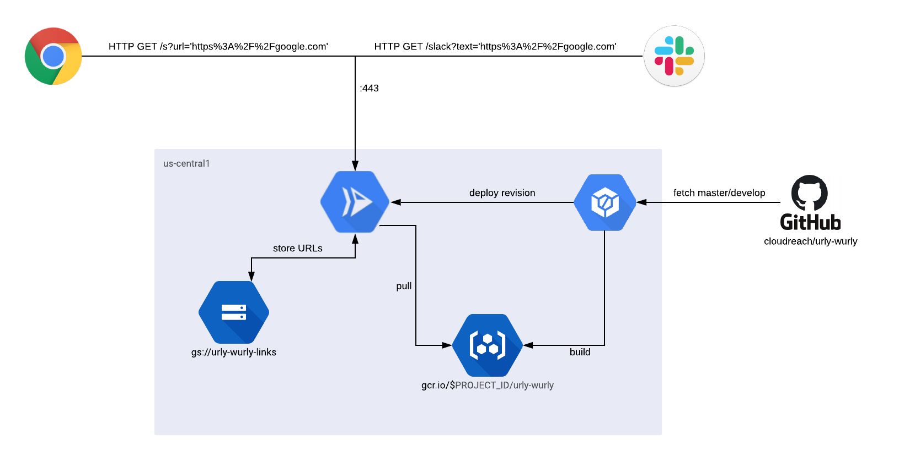

# Urly Wurly is an URL shortener build on GCP Cloud Run


## What Is It

Urly Wurly is a serverless URL shortening service, which has been created during an internal serverless competition over at [@cloudreach](https://github.com/cloudreach). This repository contains the infrastructure-as-code for deploying the necessary infrastructure on GCP as well as the actual code for a single Golang container at the heart of the service. The following diagram gives an overview of the various serverless GCP technologies at work:



## I Wanna Try It

Sure! You'll need an Google Cloud Platform project with an authenticated login (`project/editor` is preferred). In order to deploy the infrastructure you'll also need the current [Pulumi](https://www.pulumi.com/) executables installed.

Unfortunatly, you'll still need to do a couple oxf manual interactions with GCP as the required resources are not yet fully supported by either Pulumi or the underlying Terraform provider, but don't worry, I'll walk you through them.

### Enabling Services

First of all, we have to make sure that all of the required GCP service APIs have been enabled. At the time of writing these are GCP CloudBuild and GCP CloudRun. Make sure their APIs are enabled for your project.

Additionally, you'll need to have a Pulumi account setup. Please login via CLI to have an active session and you are actually able to execute the Pulumi project. If you are an experience Terraformer, you might understand how the underlying Terraform state is stored in the Pulumi SaaS backend ;)

### Connecting Source Repositories

Next, you need to authorize you GCP project to interface with your forked repository of Urly-Wurly. This can be done in GCP CloudBuild. You don't need to setup the build triggers themselves, as they are provisioned by pulumi later on.

### Populate Configuration Files

The Pulumi infrastructure deployment requires a number of set configuration values. You can either supply them in the environment-specific configuration files matching the glob `infrastructure/Pulumi.*.yaml` or via environment variables. Read the top definitions in `infrastructure/index.ts` to understand the configurations options you have.

Per default, this repository comes with two stages: `dev` and `prod`. They are mostly completely identical. The difference is that the `prod` stage defines a custom (short) DNS name to use, while the `dev` stage is simply using the one automatically supplied by GCP CloudRun. If you take a look at `infrastructure/index.ts`, you'll notice that the `prod` stage is deploying a DNS zone. If you are planning on using a custom domain for `prod`, you should first purchase the domain, set up DNS delegation to forward requests to the name servers of your newly created DNS zone, and prove ownership of the domain to Google using Webmaster Central. You will need to run the Pulumi deployment first, then delegate to your new name servers, update the validation records and wait for the verification to happen.

### IAM Bindings for GCP CloudRun

After you have deployed you CloudRun services, you'll need to manually create and IAM Binding for it to make the endpoint public. Creating this IAM Binding isn't currently supported in Terraform. Per default, GCP CloudRun will look for a GCP `Authentication Bearer` token when invoked. To make the endpoint public, add a binding for the role `roles/run.Invoker` to `groups:allUsers` for each service.

### How to Execute the Deployment

That's simple. Run:

```bash
make STAGE=dev infrastructure
```
